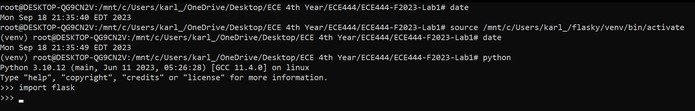
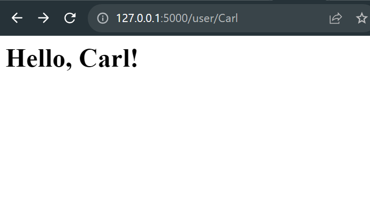
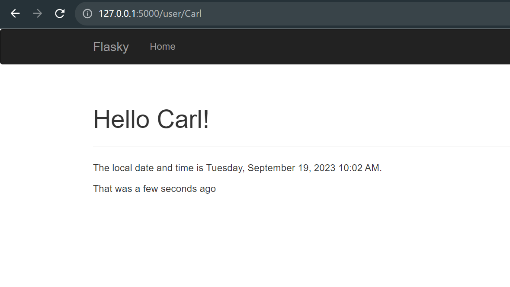
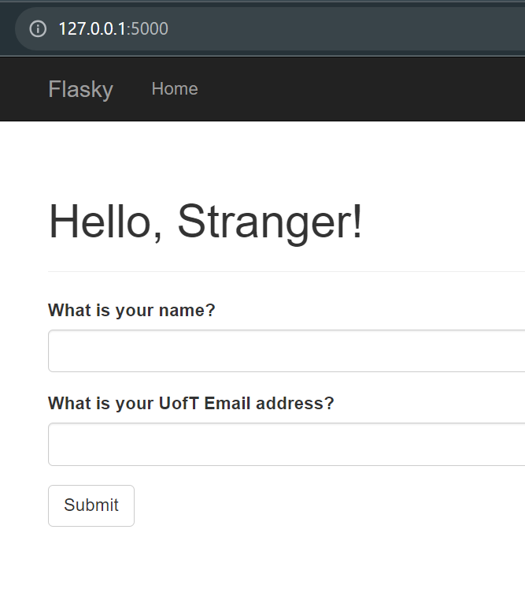
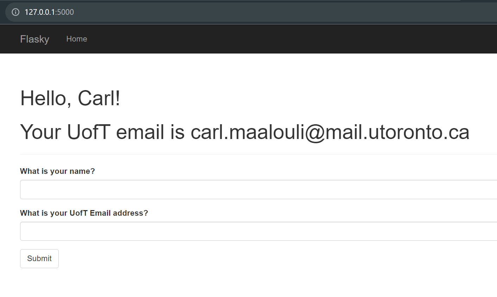
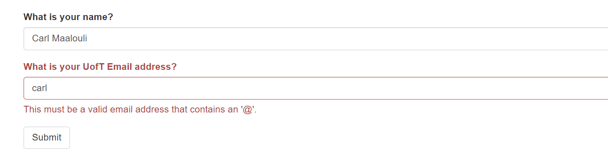
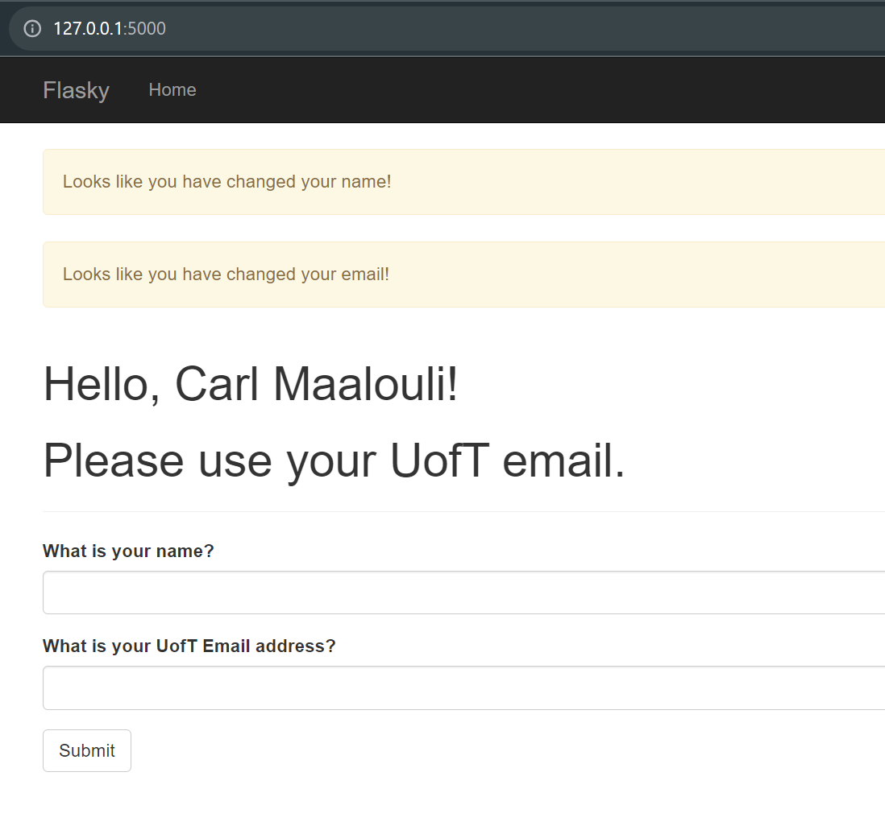

# ECE444-F2023-Lab1  

## Activity 1 (Screenshot):  
  
   
## Activity 2 (Screenshot):  
    
   
## Activity 3 (Screenshot):  
    
     
## Activity 4 (Screenshots):  
### 4.2:  
    
   
### 4.3:  
    
   
### 4.4:  
    
   
### 4.5:  
    
   

Please note that this repo is a clone of https://github.com/miguelgrinberg/flasky.

